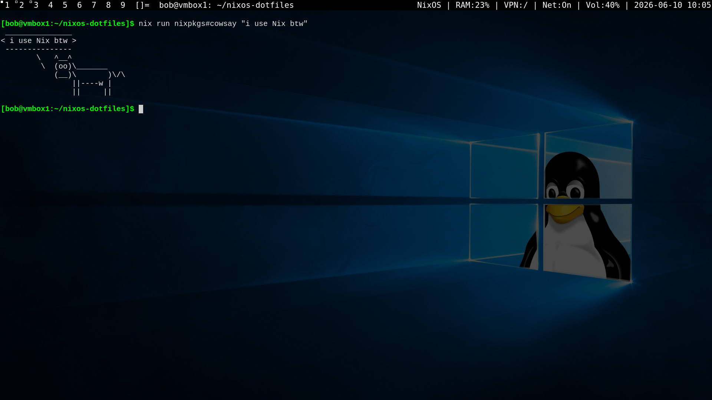

# NixOS Dotfiles

*"I use Nix btw"*

A modular NixOS configuration utilizing **Flakes** and **Home Manager** to deploy custom desktop environments across multiple machines.



---

## Repository Structure

```text
.
├── flake.lock
├── flake.nix                  # Flake entrypoint (defines hosts & inputs)
├── hosts/                     # Machine-specific configurations
│   ├── nixbox1/               # Host 1
│   │   ├── anon.nix           # Home Manager config for user 'anon'
│   │   ├── configuration.nix  # System config (Nvidia, Docker, QEMU, etc.)
│   │   └── hardware-configuration.nix
│   └── nixbox2/               # Host 2
│       ├── anon.nix
│       ├── configuration.nix
│       └── hardware-configuration.nix
├── modules/                   # Shared configs & custom packages
│   ├── pkgs/                  # Custom patched suckless builds
│   │   ├── dwm/               # Window Manager
│   │   ├── dwmblocks/         # Status Bar & Scripts
│   │   ├── slock/             # Screen Locker
│   │   └── st/                # Terminal Emulator
│   └── utils/                 # Extensible profiles (Tailscale, Nvidia, QEMU)
└── pics/                      # Wallpapers & assets
```

---

## Core Stack

- **OS:** NixOS
- **Window Manager:** dwm (patched locally via `modules/pkgs/dwm`)
- **Terminal:** st (patched locally via `modules/pkgs/st`)
- **Bar:** dwmblocks (custom scripts mapped to `$HOME/.config/dwmblocks/scripts`)
- **Display Manager:** ly
- **Compositor:** picom
- **Input Method:** fcitx5 (Mozc / Chewing for JP/TW layouts)

---

## Usage & Deployment

### Apply Configuration

Rebuild and apply the system configuration for a specific host:

```bash
# For nixbox1
sudo nixos-rebuild switch --flake .#nixbox1

# For nixbox2
sudo nixos-rebuild switch --flake .#nixbox2
```

### Add a New Host

The `flake.nix` uses a dynamic helper (`builtins.mapAttrs`) to automatically register configurations.

1. Duplicate an existing host directory:

```bash
cp -r hosts/nixbox1 hosts/your-new-hostname
```

2. Update hardware details in:

```text
hosts/your-new-hostname/hardware-configuration.nix
```

3. Change the hostname inside `configuration.nix`:

```nix
networking.hostName = "your-new-hostname";
```

4. Register the host in `flake.nix`:

```nix
hosts = {
  nixbox1 = { users = [ "anon" ]; };
  nixbox2 = { users = [ "anon" ]; };
  your-hostname = { users = [ "anon" ]; };
};
```

5. Deploy:

```bash
sudo nixos-rebuild switch --flake .#your-hostname
```

---

## Updating Packages (Flakes)

1. **Update flake inputs**:

```bash
nix flake update
```

This will fetch the latest versions of channels, nixpkgs, and other inputs defined in your `flake.nix`.

2. **Rebuild and apply updated configuration**:

```bash
sudo nixos-rebuild switch --flake .#your-hostname
```

3. **Update Home Manager for user packages**:

```bash
home-manager switch --flake .#your-hostname
```

This ensures both system and user packages are updated to the latest versions defined by your flake inputs.

---

## Maintenance & Cleanup

Nix retains historical generations so you can rollback at any time.

To permanently purge old generations and optimize disk space:

```bash
nix-collect-garbage -d
sudo nix-collect-garbage -d
nix store optimise
```
